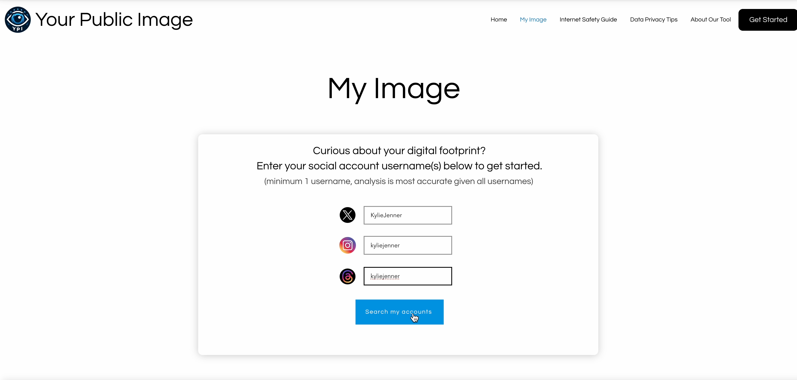
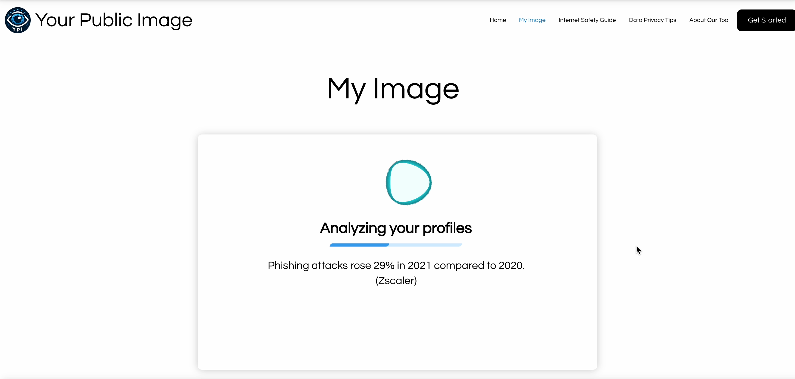
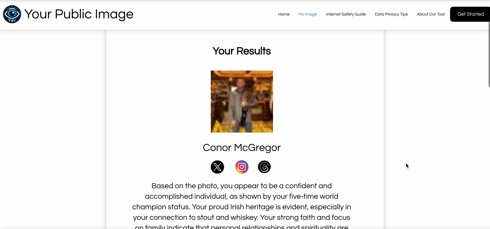
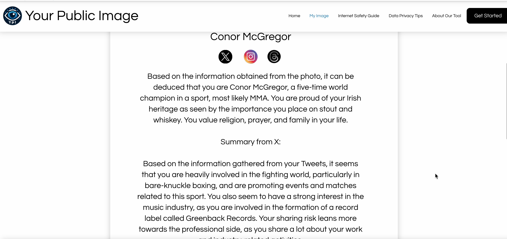
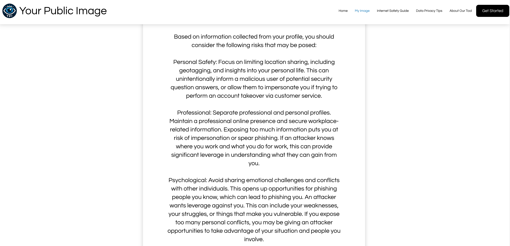

# Your Public Image

Your Public Image is a capstone project that is designed to provide cybersecurity awareness through digital footprint scraping from social media websites. When a user provides their usernames to platforms they have accounts on, YPI will scrape the targeted sites for **publicly available information** that may demonstrate a risk to the user's privacy. This involves gathering text and image posts, and leveraging ChatGPT 4-o's capabilities with context comprehension and "Vision" (understanding what an image depicts).

The tool aims to then provide insightful information to the user, including the posts that might contain oversharing, or details posted that could aid a potential attacker in performing impersonation, social engineering, or account takeoverattempts. By limiting the information you post online, you are limiting your attack surface against bad actors who would benefit from using your personal information against you. 

This can involve birthdays, family members, pets, workplace details, frequently visited locations, or specific interests. While it is important to assume a level of risk when enjoying the benefits of social media, it can also be important to understand when sharing becomes oversharing, and when information you post can be an unintentional risk to your privacy.

The `python-backend` folder contains the logic used to make the tool work, which was hosted on PythonAnywhere for this demonstration. The `wix` folder contains the JavaScript used to call the API and perform actions to display the information. The frontend was done using Wix Website Builder.

NOTE: This tool is **not** performing the scraping. It is done using an API key from the Apify service. Analysis is done with an OpenAI Key. This is for educational purposes only and is not a service I provide.

## Main page:

## Loading screen:

## Example of profile result (Connor McGregor)

## Example of analysis

## Example of generated privacy risks

